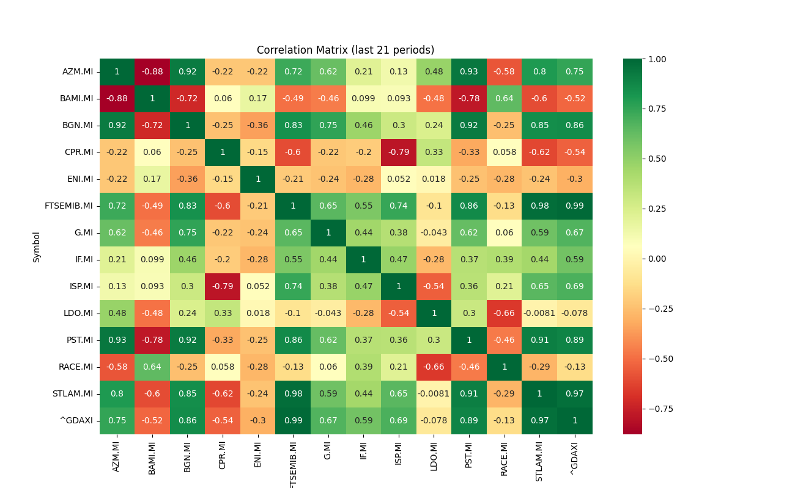

# QStudio - Correlation Matrix

The Correlation Matrix feature in QStudio allows users to analyze and visualize the correlation between different financial symbols. This feature is useful for identifying statistical relationships between the returns of different financial assets over time.

## Utility of the Correlation Matrix
1. **Identification of Relationships**
   Positive values close to 1 indicate a strong positive correlation, meaning returns move in the same direction.
   Negative values close to -1 indicate a strong negative correlation, suggesting returns move in opposite directions.
   Values close to 0 indicate a low correlation, implying returns are not closely linked.
2. **Portfolio Diversification**
   Investors can use the correlation matrix to build diversified portfolios.
   Assets with lower correlations can reduce overall portfolio risk, as returns can move independently.
   How to Read the Correlation Matrix
   Each cell in the matrix represents the correlation between two specific assets.
   Values on the diagonal (correlation of an asset with itself) are always 1.
   The matrix is symmetric about the main diagonal.

### Example Interpretation
For example, a correlation matrix might show that:

- The correlation between Stock A and Stock B is 0.8, indicating a strong positive correlation.
- The correlation between Stock A and Stock C is -0.2, indicating a modest negative correlation.
- The correlation between Stock B and Stock C is 0.1, indicating a low correlation.

In summary, the correlation matrix is a powerful tool in QStudio, providing insights into relationships between different financial assets. This information helps investors make informed decisions about constructing well-diversified portfolios.

## Symbol Configuration ##

Ensure that you have financial symbols correctly configured in the `config/symbols` file. You can view the configured symbols using the following command:
   ```commandline
   python qstudio.py --config --symbols
   ```

## Command Options

1.**Displaying the Correlation Matrix:**
To display the correlation matrix for the configured symbols, run the following command:
   ```textmate
   python qstudio.py --correlation_matrix
   ```
### Saving the Correlation Matrix
To save the correlation matrix chart for configured symbols in the repository ./output/:
   ```textmate
   python qstudio.py --correlation_matrix --save
   ```
### Specifying Custom Periods
To show the correlation matrix for configured symbols and given periods:
   ```textmate
   python qstudio.py --correlation_matrix --periods [periods]
   ```
### Saving Correlation Matrix with Custom Periods
To save the correlation matrix for configured symbols and given periods in the repository `./output/`:
```textmate
python qstudio.py --correlation_matrix --periods [periods] --save
```

### Correlation Matrix for Given Symbols
To show the correlation matrix for given symbols:
```textmate
python qstudio.py --correlation_matrix --symbols [symbols]
```

### Saving Correlation Matrix for Given Symbols
To save the correlation matrix chart for given symbols in the repository `./output/`:
```textmate
python qstudio.py --correlation_matrix --symbols [symbols] --save
```

### Correlation Matrix for Given Symbols and Periods
To show the correlation matrix chart for given symbols for the given periods:
```textmate
python qstudio.py --correlation_matrix --symbols [symbols] --periods [periods]
```

### Saving Correlation Matrix for Given Symbols and Periods
To save the correlation matrix chart for given symbols for the given periods in the repository `./output/`:
```textmate
python qstudio.py --correlation_matrix --symbols [symbols] --periods [periods] --save
```

## Examples

- Display the correlation matrix of configured symbols:
  ```pythonregexp
  python qstudio.py --correlation_matrix
  ```


- Show the correlation matrix chart for XSX6.DE,FTSEMIB.MI,ENI.MI,ISP.MI symbols for the last 90 days
  ```pythonregexp
  python qstudio.py --correlation_matrix --symbols XSX6.DE,FTSEMIB.MI,ENI.MI,ISP.MI --periods 90
  ```


## Important Notes

- The Correlation Matrix is based on historical price data of the symbols configured in QStudio.
- Ensure to keep your financial data up-to-date in your Datahub using the command `--datahub --update-all`.
