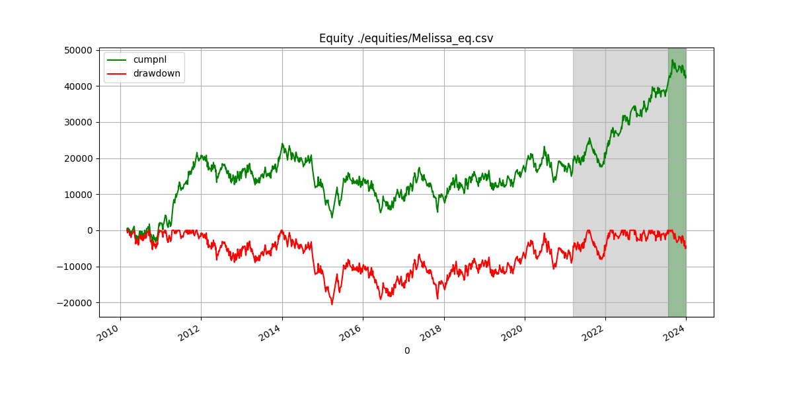
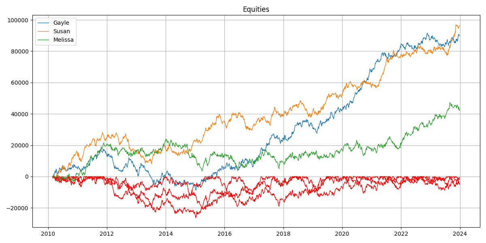

# QStudio - Strategy Evaluator

[Home](index.md)

## Table of Contents
- [Introduction](#introduction)
- [Prerequisites](#prerequisites)
- [Evaluation Periods](#evaluation-periods)
- [Evaluation Method](#evaluation-method)
- [Usage](#usage)


## Introduction

Provides a comprehensive toolkit for strategy evaluation. This functionality enables users to evaluate the effectiveness of their strategies by providing comprehensive reports and metrics.

## Prerequisites:

Before using the **Strategy Evaluator** in QStudio, ensure the following prerequisites:

1. **Equity Data Format:**
    - Save equity data for each strategy in a folder in CSV format with two columns: `date` and `equity value`.
    - The filename should correspond to the name of the strategy.

For example, if you have a strategy named "MyStrategy," the equity data file should be named "MyStrategy.csv" and have the following format:

```csv
2023-01-01, 10000
2023-01-02, 10200
2023-01-03, 9800
...
```

This format is crucial for the **Strategy Evaluator** to accurately assess and analyze the performance of each strategy. Ensure that equity data files are prepared accordingly before running the evaluator.


## Evaluation Periods


- **Full Term:**
    - Represents the entire historical data available for evaluation. The metrics under "Full Term" consider the overall performance over the complete dataset.

- **Long Term:**
    - Focuses on a specific portion of the chart highlighted in gray. The "Long Term" metrics provide insights into the performance of the strategy within this highlighted region.

- **Short Term:**
    - Targets a distinct section of the chart highlighted in green. The "Short Term" metrics offer a detailed analysis of the strategy's performance within this highlighted timeframe.

These differentiated evaluation periods allow for a comprehensive understanding of the strategy's behavior over the complete dataset as well as specific highlighted intervals.

### Default Periods
The default evaluation periods are set as an **18-month duration for the Long Term** and a **3-month duration for the Short Term**. These periods represent the highlighted portions in gray and green on the chart, respectively. This default setup ensures a balanced evaluation, considering both a more extended historical context and shorter-term fluctuations for a comprehensive strategy analysis.

## Evaluation method
The determination of whether a strategy should remain active or be halted follows a specific rule: 
```doctest
    PnL(Long-Term) > 0 and PnL(Short-Term) > 0 
```
if the PnL (Profit and Loss) for the Long Term (gray) is positive, and the PnL for the Short Term (green) is also positive, then the system is considered to be kept active. 

Additional evaluation methods, such as the number of operations conducted during the assessment period, could be explored for more or less stringent criteria based on specific preferences or requirements. The flexibility of the evaluation method allows users to tailor the decision-making process according to their trading goals and preferences.

## Usage


- Show how to use the `strategy_evaluator` by opening this doc:
  ```textmate
  python qstudio.py --strategy_evaluator --help
  ```

### Multi-Strategy Evaluator

- Run the `strategy_evaluator` for strategies in a specific folder without generating charts:
  ```textmate
  python qstudio.py --strategy_evaluator --folder [folder]
  ```

- Run the `strategy_evaluator` for strategies in a specific folder and generate a report:
  ```textmate
  python qstudio.py --strategy_evaluator --folder [folder] --report
  ```
  ### Example
  ```pythonregexp
   python qstudio.py --strategy_evaluator --folder ./equities --report
  ```
  output:

    ~~~textmate
    ------------------------------------------------------------------------------------------------------------------------
     Q S t u d i o   v0.3.5
     2023 (c) Alberto Sfolcini <a.sfolcini@gmail.com>
     www.surprisalx.com
    ------------------------------------------------------------------------------------------------------------------------
    Check Strategy in folder ./equities
    +------------------------------------------------+
    |            Terrie [status:STOPPED]             |
    +-----------+-----------+-----------+------------+
    |           | Full Term | Long Term | Short Term |
    +-----------+-----------+-----------+------------+
    |       PnL |    133628 |     39661 |       -543 |
    |  Drawdown |     -8024 |     -8024 |      -8024 |
    | Avg Trade |     65.28 |    104.92 |      -8.62 |
    +-----------+-----------+-----------+------------+
    +------------------------------------------------+
    |             Gayle [status:ACTIVE]              |
    +-----------+-----------+-----------+------------+
    |           | Full Term | Long Term | Short Term |
    +-----------+-----------+-----------+------------+
    |       PnL |     89743 |     12028 |       3081 |
    |  Drawdown |    -26261 |     -8841 |      -8051 |
    | Avg Trade |     44.63 |     31.82 |       48.9 |
    +-----------+-----------+-----------+------------+
    +------------------------------------------------+
    |             Susan [status:ACTIVE]              |
    +-----------+-----------+-----------+------------+
    |           | Full Term | Long Term | Short Term |
    +-----------+-----------+-----------+------------+
    |       PnL |     96366 |     30337 |      17554 |
    |  Drawdown |    -20083 |     -6408 |      -3737 |
    | Avg Trade |     48.57 |     80.26 |     278.63 |
    +-----------+-----------+-----------+------------+
    +------------------------------------------------+
    |            Melissa [status:ACTIVE]             |
    +-----------+-----------+-----------+------------+
    |           | Full Term | Long Term | Short Term |
    +-----------+-----------+-----------+------------+
    |       PnL |     42831 |     24680 |       1337 |
    |  Drawdown |    -20599 |     -8070 |      -5080 |
    | Avg Trade |     21.95 |     65.29 |      21.22 |
    +-----------+-----------+-----------+------------+
    +------------------------------------------------+
    |           Marjorie [status:STOPPED]            |
    +-----------+-----------+-----------+------------+
    |           | Full Term | Long Term | Short Term |
    +-----------+-----------+-----------+------------+
    |       PnL |     94630 |     -5736 |      -6572 |
    |  Drawdown |    -16269 |    -13115 |     -13115 |
    | Avg Trade |     45.04 |    -15.17 |    -104.32 |
    +-----------+-----------+-----------+------------+
    +-------------------------------------------------------------------+
    |                              SUMMARY                              |
    +----------------------------+----------+--------+------------------+
    |                   filepath | strategy | status | sharpe_ratio_ann |
    +----------------------------+----------+--------+------------------+
    |   ./equities/Terrie_eq.csv |   Terrie |  False |             2.77 |
    |    ./equities/Susan_eq.csv |    Susan |   True |             2.04 |
    |  ./equities/Melissa_eq.csv |  Melissa |   True |             1.71 |
    |    ./equities/Gayle_eq.csv |    Gayle |   True |             0.83 |
    | ./equities/Marjorie_eq.csv | Marjorie |  False |            -0.39 |
    +----------------------------+----------+--------+------------------+
    ~~~
  ### Explanation

    The summary table provides an overview of the evaluated strategies, indicating whether each strategy should be stopped, activated, or kept active (status). Additionally, the equity graph displays the equities of only the active strategies. This visual representation helps to track the performance of the currently active strategies over time.

### Single Strategy Evaluator

- Run the `strategy_evaluator` for a single strategy from a file without generating charts:
  ```textmate
  python qstudio.py --single_strategy_evaluator --file [file]
  ```
  ### Example
  ```pythonregexp
   python qstudio.py --single_strategy_evaluator --file ./equities/Melissa_eq.csv
  ```
  output:
    ~~~textmate
    ------------------------------------------------------------------------------------------------------------------------
     Q S t u d i o   v0.3.5
     2023 (c) Alberto Sfolcini <a.sfolcini@gmail.com>
     www.surprisalx.com
    ------------------------------------------------------------------------------------------------------------------------
    Check single Strategy with equity file: ./equities/Melissa_eq.csv
    +------------------------------------------------+
    |   ./equities/Melissa_eq.csv [status:ACTIVE]    |
    +-----------+-----------+-----------+------------+
    |           | Full Term | Long Term | Short Term |
    +-----------+-----------+-----------+------------+
    |       PnL |     42831 |     24680 |       1337 |
    |  Drawdown |    -20599 |     -8070 |      -5080 |
    | Avg Trade |     21.95 |     65.29 |      21.22 |
    +-----------+-----------+-----------+------------+
    ~~~

    ### Explanation:
  - The **evaluation** is performed on the equity file located at "./equities/Melissa_eq.csv," The status of the strategy is marked as "ACTIVE," indicating that the evaluation suggests maintaining the strategy in its current active state.

  - **Performance Metrics:**
      - **PnL (Profit and Loss):**
          - **Full Term:** The total profit and loss over the entire period is 42831.
          - **Long Term:** The profit and loss for long-term trades is 24680.
          - **Short Term:** The profit and loss for short-term trades is 1337.

      - **Drawdown:**
          - **Full Term:** The maximum drawdown over the entire period is -20599.
          - **Long Term:** The maximum drawdown for long-term trades is -8070.
          - **Short Term:** The maximum drawdown for short-term trades is -5080.

      - **Average Trade:**
          - **Full Term:** The average profit or loss per trade over the entire period is 21.95.
          - **Long Term:** The average profit or loss per trade for long-term trades is 65.29.
          - **Short Term:** The average profit or loss per trade for short-term trades is 21.22.

  
- Run the `strategy_evaluator` for a single strategy from a file and generate a report:
  ```textmate
  python qstudio.py --single_strategy_evaluator --file [file] --report
  ```
  output:

    ~~~textmate
    ------------------------------------------------------------------------------------------------------------------------
     Q S t u d i o   v0.3.5
     2023 (c) Alberto Sfolcini <a.sfolcini@gmail.com>
     www.surprisalx.com
    ------------------------------------------------------------------------------------------------------------------------
    Check single Strategy with equity file: ./equities/Melissa_eq.csv
    +------------------------------------------------+
    |   ./equities/Melissa_eq.csv [status:ACTIVE]    |
    +-----------+-----------+-----------+------------+
    |           | Full Term | Long Term | Short Term |
    +-----------+-----------+-----------+------------+
    |       PnL |     42831 |     24680 |       1337 |
    |  Drawdown |    -20599 |     -8070 |      -5080 |
    | Avg Trade |     21.95 |     65.29 |      21.22 |
    +-----------+-----------+-----------+------------+
    ~~~


These examples demonstrate how to use the **Strategy Evaluator** to assess the performance of trading strategies either in bulk from a folder or for a single strategy from a file, with or without generating detailed reports.


[Top](#qstudio---strategy-evaluator)