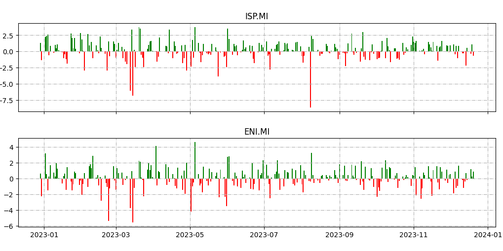
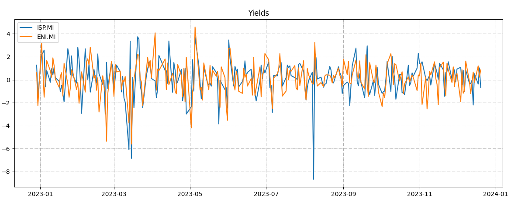
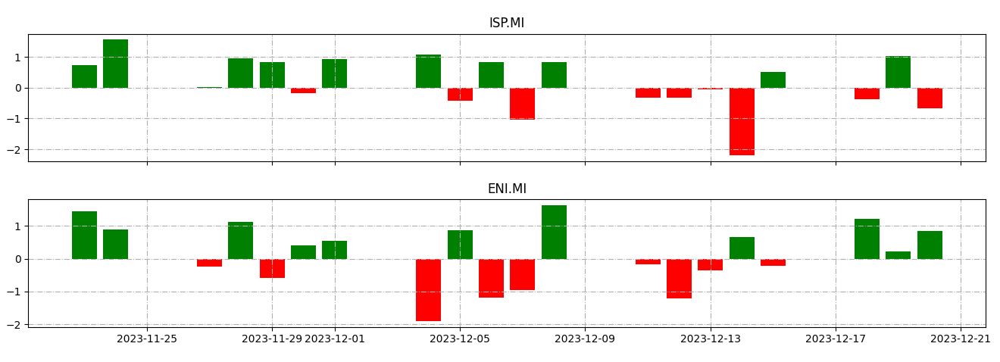
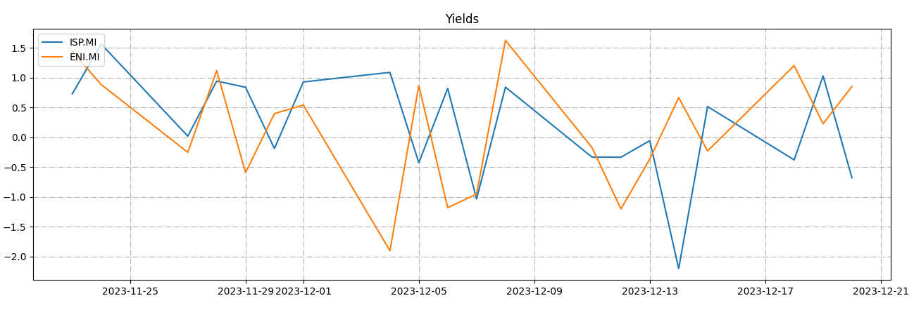
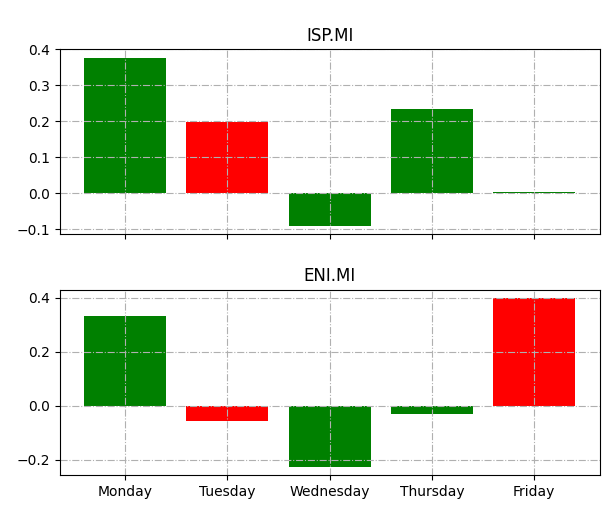
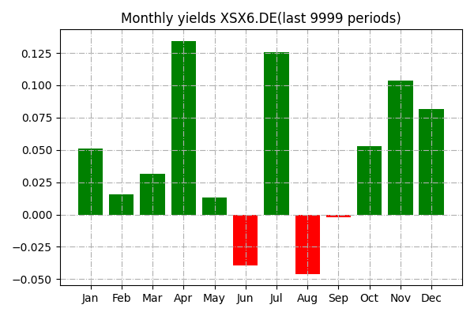
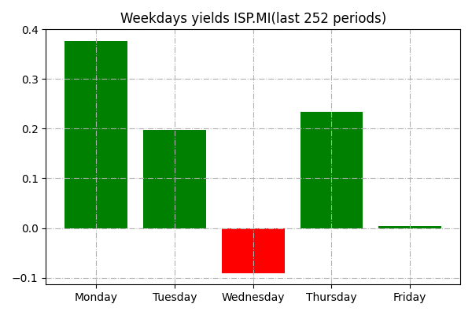
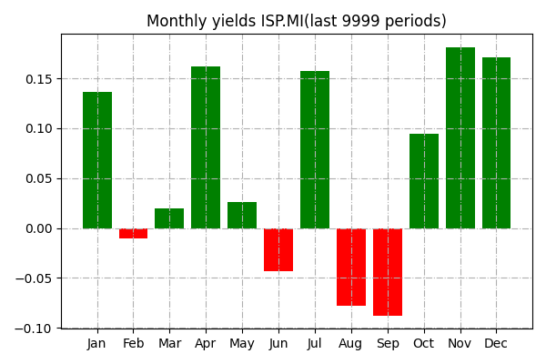

# QStudio - Yields Visualization

[Home](index.md)

### Table of Contents
- [Introduction](#introduction)
- [yields Daily](#yields-daily)
- [yields Weekly](#yields-weekly)
- [yields Monthly](#yields-monthly)
- [Example of Bias Study](#example-of-bias-study)


## Introduction

The Yields feature in QStudio allows users to analyze and visualize financial returns for specific symbols across various time intervals. 

This functionality provides insights into the performance and trends of financial instruments.
Analyzing yields within specific timeframes, such as weekly returns, can help traders discover biases that can be exploited for trading purposes. By visually inspecting the performance of financial instruments over short-term intervals, traders may identify patterns, trends, or anomalies that can inform their trading strategies.

A bias-based strategy in trading leverages recurring patterns or statistical distortions in market data to identify trading opportunities. These "biases" can involve temporal trends, weekly behaviors, or other phenomena that occur regularly. The strategy aims to capitalize on these predictable trends to achieve profits.

Below are the options available for using the Yields feature:

## Yields Daily

- **Show Yields for Given Symbols:**
   ```textmate
   python qstudio.py --yields --symbols [symbols]
   ```
  ### Example
  ```pythonregexp
   python qstudio.py --yields --symbols ISP.MI,ENI.MI
  ```
  output:
  


- **Show Overlaid Yields for Given Symbols:**
   ```textmate
   python qstudio.py --yields --symbols [symbols] --overlay
   ```
  ### Example
  ```pythonregexp
   python qstudio.py --yields --symbols ISP.MI,ENI.MI --overlay
  ```
  output:
  


- **Save Yields Chart for Given Symbols:**
   ```textmate
   python qstudio.py --yields --symbols [symbols] --save
   ```

- **Save Overlaid Yields Chart for Given Symbols:**
   ```textmate
   python qstudio.py --yields --symbols [symbols] --save --overlay
   ```

- **Show Yields Chart for Given Symbols and Periods:**
   ```textmate
   python qstudio.py --yields --symbols [symbols] --periods [periods]
   ```
  ### Example
  ```pythonregexp
   python qstudio.py --yields --symbols ISP.MI,ENI.MI --periods 21
  ```
  output:
  


- **Show Overlaid Yields Chart for Given Symbols and Periods:**
   ```textmate
   python qstudio.py --yields --symbols [symbols] --periods [periods] --overlay
   ```
  ### Example
  ```pythonregexp
   python qstudio.py --yields --symbols ISP.MI,ENI.MI --periods 21 --overlay
  ```
  output:
  


- **Save Overlaid Yields Chart for Given Symbols and Periods:**
   ```textmate
   python qstudio.py --yields --symbols [symbols] --periods [periods] --save --overlay
   ```


## Yields Weekly

- **Show Weekly Yields for Given Symbols:**
   ```textmate
   python qstudio.py --yields_weekly --symbols [symbols]
   ```
  ### Example
  ```pythonregexp
   python qstudio.py --yields_weekly --symbols ISP.MI,ENI.MI
  ```
  output:

  

- **Save Weekly Yields Chart for Given Symbols:**
   ```textmate
   python qstudio.py --yields_weekly --symbols [symbols] --save
   ```

- **Show Weekly Yields Chart for Given Symbols and Periods:**
   ```textmate
   python qstudio.py --yields_weekly --symbols [symbols] --periods [periods]
   ```

- **Save Weekly Yields Chart for Given Symbols and Periods:**
   ```textmate
   python qstudio.py --yields_weekly --symbols [symbols] --periods [periods] --save
   ```

## Yields Monthly

- **Show Monthly Yields for Given Symbols:**
   ```textmate
   python qstudio.py --yields_monthly --symbols [symbols]
   ```
  ### Example
  ```pythonregexp
   python qstudio.py --yields_monthly --symbols XSX6.DE
  ```
  output:

  


- **Save Monthly Yields Chart for Given Symbols:**
   ```textmate
   python qstudio.py --yields_monthly --symbols [symbols] --save
   ```

- **Show Monthly Yields Chart for Given Symbols and Periods:**
   ```textmate
   python qstudio.py --yields_monthly --symbols [symbols] --periods [periods]
   ```

- **Save Monthly Yields Chart for Given Symbols and Periods:**
   ```textmate
   python qstudio.py --yields_monthly --symbols [symbols] --periods [periods] --save
   ```


  ## Example of Bias Study
  We want to study the BIAS on weekly days of symbol `ISP.MI`:
  
  ```pythonregexp
   python qstudio.py --yields_weekly --symbols ISP.MI --periods 252
  ```
  output:

  

  By examining the resulting chart, we can observe trends and patterns in the weekly returns.

  In the example chart:

  - **Monday and Tuesday:** Show an upward trend, indicating potentially bullish behavior.
  - **Wednesday:** Demonstrates a downward trend, suggesting bearish behavior.

  ### Trading Strategy Implementation
  Based on these statistical insights, a trader may consider implementing a trading strategy that exploits the observed biases on specific days of the week. For instance:

  - **Long Positions (Buy):** Consider entering long positions on Mondays and Tuesdays when a bullish trend is observed.
  - **Short Positions (Sell):** Consider entering short positions on Wednesdays when a bearish trend is observed.


  ### Adding Monthly Filter
  By utilizing the monthly returns visualization, we can enhance the BIAS strategy by introducing a filter that specifies which months to include or exclude in long or short trades based on statistical considerations. This allows for a more nuanced and tailored approach, adjusting the strategy's execution according to the historical performance of specific months.

  ```pythonregexp
   python qstudio.py --yields_monthly --symbols ISP.MI
  ```
  output:

  

  From the chart of monthly returns, it is evident that June, August, and September statistically exhibit a bearish trend, February is neutral, and the remaining months are bullish. Based on these observations, it is possible to implement filters for long and short trades in the bias trading system. This strategic adjustment ensures that the trading decisions align with the historical performance of specific months, enhancing the effectiveness and adaptability of the overall strategy.

  ### Overfitting Warning
  Implementing such a strategy involves careful consideration of risk management, market conditions, and additional technical analysis. However, it is crucial to be cautious about overfitting, a phenomenon where a strategy is tailored too closely to historical data, potentially leading to suboptimal performance in real-world conditions. It's essential to strike a balance between incorporating historical patterns and ensuring the strategy remains adaptable to changing market dynamics. Regular monitoring, evaluation, and adjustments are vital to mitigate the risks associated with overfitting.


[Top](#qstudio---yields-visualization)